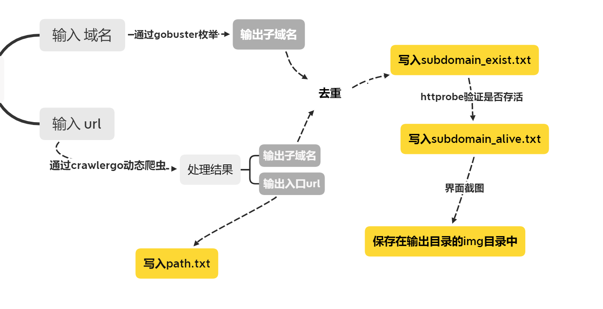

# Subdomain_Get

​	在src和渗透测试中，信息收集是很重要的一步。但子域名的收集往往会有重复和不必要的工作，如对web测试时 dns.xxx.com 这种无法通过http请求直接访问的域名、以及枚举结果中不存活的域名。目前优秀的子域名枚举和收集工具有很多（向前辈们学习），若能结合工具的优势实现子域名的收集、存活性验证、对存活域名界面截图功能整合，会提升信息收集阶段的效率。


## 介绍

脚本中使用的优秀工具

 https://github.com/OJ/gobuster  				      子域名枚举

 https://github.com/0Kee-Team/crawlergo       使用chrome headless模式进行URL入口收集的动态爬虫 

 https://github.com/tomnomnom/httprobe      探查可正常访问的http和https服务器


**逻辑如下：**



- path.txt 和subdomain_alive.txt 中保存的是url，在notepad中可直接访问，方便测试


## 用法

```
usage:
    sub.py [-h]
    sub.py -d <domain>   -u <url>  [-w <dictionary_path>]  [-o <dirname>]
    sub.py -f <submain_file_path>   [-o <dirname>]


optional arguments:
  -h, --help            show this help message and exit
  -u URL, --url URL     input url to crawlergo
  -d DOMAIN, --domain DOMAIN
                        input domain to burst
  -w DICTIONARY, --dictionary DICTIONARY
                        input dictionary to burst, default is 3000.txt
  -f FILE, --file FILE  input your subdomain file to verify
  -o DIRNAME, --dirname DIRNAME
                        input dirname to save result, default is time
                        

参数：
  -u URL --url URL                输入目标url
  -d DOMAIN, --domain DOMAIN      输入目标域名
  -w DICTIONARY, --dictionary DICTIONARY
  								  输入枚举字典路径，默认为3000.txt
  -f FILE, --file FILE            输入一个子域名文件路径
  -o DIRNAME, --dirname DIRNAME	  指定结果输出的目录名，默认名为当前时间
```


##### 用法1.直接对目标进行测试

```
python3  sub.py  -d  bing.com  -u  https://bing.com  -o  bing_result 
```


##### 用法2. 对其他方法获取的子域名存活性验证并对界面截图

子域名收集的方法很多，可以用不同方法收集到的结果去做验证

```
python3  sub.py  -f subdomain.txt  -o  result
```


## 必要准备

- 第一次运行前在脚本中输入可执行文件的绝对路径

    `gobuster_path`                  https://github.com/OJ/gobuster/releases    				   

    `crawlergo_path`                https://github.com/0Kee-Team/crawlergo/releases      

    `httprobe_path`                  https://github.com/tomnomnom/httprobe/releases  

    `chrome_path`				  	chromium

    

-   正确配置PhantomJs环境变量

-  `pip  install  webscreenshot`


## 演示

目标：清华大学


